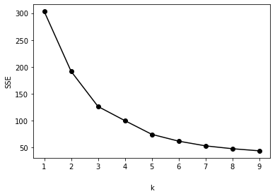
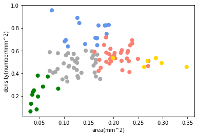
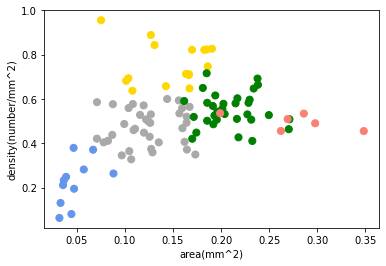
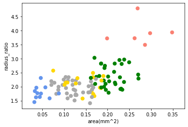
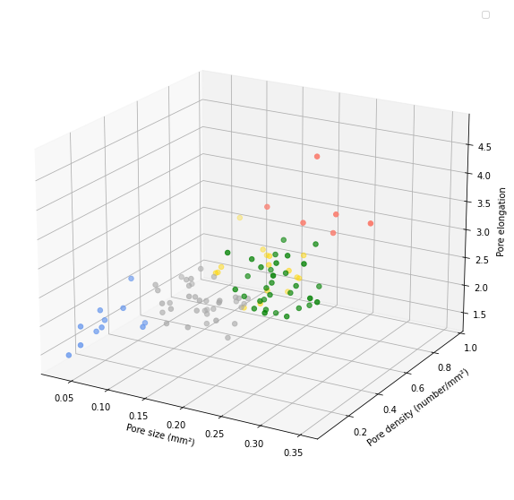

## Skin Pores Clustering

<br>This project was for analyzing a distribution and features of skin pores from wide range of subjects <br>
Patterns behind the change of skin pores over aging could be observed by using K-means clustring algorithm. <br>
The project was a part of study for skin pores ([**published**](https://onlinelibrary.wiley.com/doi/10.1111/srt.13082))
<br><br>

### STEP 1

Import the required libraries and load the raw data.
The raw data includes 3 features of skin pores from 101 subjects.<br>

```python
import pandas as pd
import numpy as np
import matplotlib.pyplot as plt
import sklearn
from sklearn.cluster import KMeans
from mpl_toolkits.mplot3d import Axes3D
from sklearn.preprocessing import scale
from sklearn import datasets
```

```python
df = pd.read_csv('data.csv')
df = df[df.columns[1:4]]
X = scale(df)
```

<br>

### STEP 2

Determine the optimal number of clusters using the Elbow method.<br>

```python
def elbow(X):
    sse = []
    for i in range(1, 10):
        km = KMeans(n_clusters = i, random_state=5)
        km.fit(X)
        sse.append(km.inertia_)

    pl = plt.plot(range(1,10), sse, marker = 'o', color = 'black')
    plt.xlabel('k', labelpad = 20)
    plt.ylabel('SSE')
    plt.show()

elbow(X)
```


<br>

### STEP 3

Fit clustering model using the determined number of clusters from the Elbow method.

```python
clustering = KMeans(n_clusters = 5, random_state = 5)
clustering.fit(X)
```

    KMeans(n_clusters=5, random_state=5)

<br>

### STEP 4

Assign a color theme for differentiating clusters visually.

```python
color_theme = np.array(['cornflowerblue', 'darkgray', 'gold', 'green', 'salmon'])
plt.plot()
plt.scatter(x=df.mean_area, y = df.density, c = color_theme[clustering.labels_], s = 50)
plt.xlabel('area(mm^2)')
plt.ylabel('density(number/mm^2)')
```

    Text(0, 0.5, 'density(number/mm^2)')

  
<br>

### STEP 5

Relabel the clusters in the same order as the color theme.

```python
relabel = np.choose(clustering.labels_, [2, 1, 4, 0, 3]).astype(np.int64)
plt.plot()
plt.scatter(x=df.mean_area, y = df.density, c = color_theme[relabel], s = 50)
plt.xlabel('area(mm^2)'
          )
plt.ylabel('density(number/mm^2)')
```

    Text(0, 0.5, 'density(number/mm^2)')



```python
plt.plot()
plt.scatter(x=df.mean_area, y = df.ratio_axis, c = color_theme[relabel], s = 50)
plt.xlabel('area(mm^2)'
          )
plt.ylabel('radius_ratio')
```

    Text(0, 0.5, 'radius_ratio')


<br>

### STEP 6

Given that there are 3 features, generate a 3D plot for comprehensive understanding of the clusters.

```python
fig = plt.figure(figsize = (15,10))
ax = fig.gca(projection = '3d')
ax.scatter(xs=df.mean_area, ys=df.density, zs=df.ratio_axis, c = color_theme[relabel], s = 30)
ax.set_xlabel('Pore size (mm\u00b2)')
ax.set_ylabel('Pore density (number/mm\u00b2)')
ax.set_zlabel('Pore elongation')
ax.view_init(20,-60 )
plt.legend()
plt.show()
```


<br>

### STEP 7

The labels indicate the cluster to which each subject belongs. Check the array of subjects labeled with their respective clusters and the array of the number of subjects from each cluster for further analysis.

```python
relabel
```

    array([1, 0, 1, 3, 1, 2, 1, 1, 1, 1, 3, 3, 3, 2, 3, 3, 3, 1, 2, 1, 3, 1,
           1, 1, 2, 2, 2, 2, 3, 1, 1, 3, 1, 1, 1, 2, 3, 2, 1, 1, 3, 1, 3, 1,
           2, 3, 3, 1, 1, 1, 3, 3, 2, 1, 2, 3, 1, 1, 1, 3, 0, 0, 0, 0, 0, 1,
           2, 0, 1, 1, 1, 2, 0, 0, 0, 2, 0, 3, 1, 3, 3, 1, 3, 3, 3, 3, 2, 3,
           4, 4, 3, 4, 1, 3, 4, 3, 3, 1, 4, 4, 3], dtype=int64)

```python
np.array([len([i for i in relabel if i == 0]), len([i for i in relabel if i ==1]), len([i for i in relabel if i ==2]),\
        len([i for i in relabel if i ==3]), len([i for i in relabel if i ==4])])
```

    array([ 9, 27, 18, 38,  9])
