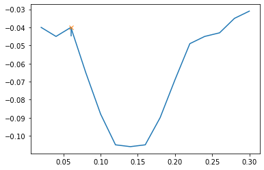
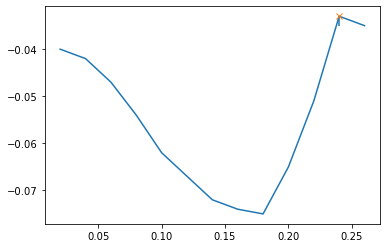
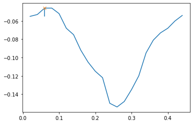
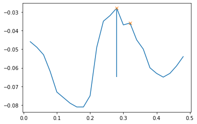
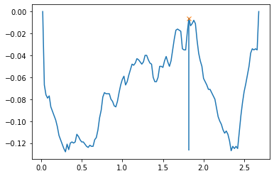
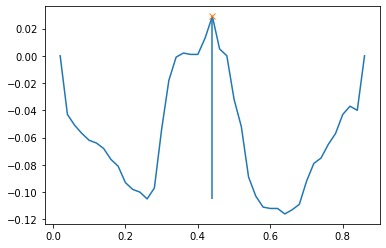
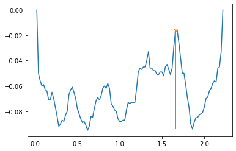

## Skin Pores Topography Analysis
<br>This project was for analyzing topographical features of skin pores. <br>
For over 20k skin pores from 101 subjects, quantitative analysis was done adopting signal processing methods. <br>
The project was a part of study of skin pores ([**published**](https://onlinelibrary.wiley.com/doi/10.1111/srt.13082)) 
<br><br>

### STEP 1
Import the required libraries and load the raw data.<br>
```python
import numpy as np
import pandas as pd
from scipy.signal import find_peaks, peak_prominences
from scipy.signal import savgol_filter
import matplotlib.pyplot as plt
```


```python
df = pd.read_csv('pore_df.csv')
df
```


<div>

<table border="1" class="dataframe">
  <thead>
    <tr style="text-align: right;">
      <th></th>
      <th>Subject</th>
      <th>Pore Number</th>
      <th>Area (mm²)</th>
      <th>Depth (mm)</th>
      <th>Max Depth (mm)</th>
      <th>Exact Volume (mm3)</th>
      <th>Principal Axis Length (mm)</th>
      <th>Secondary Axis Length (mm)</th>
      <th>Depth Along Principal Axis</th>
      <th>Depth Along Secondary Axis</th>
    </tr>
  </thead>
  <tbody>
    <tr>
      <th>0</th>
      <td>1</td>
      <td>1</td>
      <td>0.1396</td>
      <td>0.057713</td>
      <td>0.135919</td>
      <td>0.008057</td>
      <td>0.395980</td>
      <td>0.382099</td>
      <td>-0.0399998,-0.045,-0.04,-0.0650002,-0.0879999,...</td>
      <td>-0.0259999,-0.031,-0.0419999,-0.061,-0.0799997...</td>
    </tr>
    <tr>
      <th>1</th>
      <td>1</td>
      <td>2</td>
      <td>0.0660</td>
      <td>0.050416</td>
      <td>0.078150</td>
      <td>0.003327</td>
      <td>0.288444</td>
      <td>0.233238</td>
      <td>-0.04,-0.042,-0.047,-0.054,-0.062,-0.067,-0.07...</td>
      <td>-0.037,-0.0429999,-0.0629999,-0.069,-0.069,-0....</td>
    </tr>
    <tr>
      <th>2</th>
      <td>1</td>
      <td>3</td>
      <td>0.2412</td>
      <td>0.054819</td>
      <td>0.154681</td>
      <td>0.013222</td>
      <td>0.580000</td>
      <td>0.495177</td>
      <td>-0.055,-0.053,-0.046,-0.046,-0.0519998,-0.068,...</td>
      <td>-0.036,-0.0370001,-0.0499999,-0.059,-0.0679999...</td>
    </tr>
    <tr>
      <th>3</th>
      <td>1</td>
      <td>4</td>
      <td>0.1516</td>
      <td>0.054240</td>
      <td>0.120095</td>
      <td>0.008223</td>
      <td>0.438634</td>
      <td>0.368782</td>
      <td>-0.033,-0.0380001,-0.043,-0.0530002,-0.063,-0....</td>
      <td>0.00399999,-0.00200002,-0.0230003,-0.0669998,-...</td>
    </tr>
    <tr>
      <th>4</th>
      <td>1</td>
      <td>5</td>
      <td>0.0928</td>
      <td>0.048031</td>
      <td>0.078854</td>
      <td>0.004457</td>
      <td>0.404969</td>
      <td>0.260768</td>
      <td>-0.039,-0.041,-0.0530001,-0.056,-0.058,-0.059,...</td>
      <td>-0.0160002,-0.04,-0.052,-0.064,-0.0660001,-0.0...</td>
    </tr>
    <tr>
      <th>...</th>
      <td>...</td>
      <td>...</td>
      <td>...</td>
      <td>...</td>
      <td>...</td>
      <td>...</td>
      <td>...</td>
      <td>...</td>
      <td>...</td>
      <td>...</td>
    </tr>
    <tr>
      <th>23791</th>
      <td>110</td>
      <td>311</td>
      <td>0.1220</td>
      <td>0.044792</td>
      <td>0.088566</td>
      <td>0.005465</td>
      <td>0.388330</td>
      <td>0.349285</td>
      <td>-0.048,-0.048,-0.0710005,-0.095,-0.096,-0.097,...</td>
      <td>-0.0389998,-0.0449998,-0.0550006,-0.074,-0.074...</td>
    </tr>
    <tr>
      <th>23792</th>
      <td>110</td>
      <td>312</td>
      <td>0.0520</td>
      <td>0.023058</td>
      <td>0.046342</td>
      <td>0.001199</td>
      <td>0.233238</td>
      <td>0.205913</td>
      <td>-0.0429998,-0.0399998,-0.036,-0.033,-0.033,-0....</td>
      <td>-0.043,-0.045,-0.0459999,-0.04,-0.041,-0.03800...</td>
    </tr>
    <tr>
      <th>23793</th>
      <td>110</td>
      <td>313</td>
      <td>0.1928</td>
      <td>0.070325</td>
      <td>0.120821</td>
      <td>0.013559</td>
      <td>0.564624</td>
      <td>0.420476</td>
      <td>-0.0739999,-0.074,-0.0819999,-0.0790001,-0.077...</td>
      <td>-0.0360004,-0.053,-0.062,-0.068,-0.0769999,-0....</td>
    </tr>
    <tr>
      <th>23794</th>
      <td>110</td>
      <td>314</td>
      <td>0.2152</td>
      <td>0.046200</td>
      <td>0.100157</td>
      <td>0.009942</td>
      <td>0.557853</td>
      <td>0.398497</td>
      <td>-0.0329998,-0.0339999,-0.032,-0.0290001,-0.036...</td>
      <td>-0.0460001,-0.048,-0.0520001,-0.0559999,-0.056...</td>
    </tr>
    <tr>
      <th>23795</th>
      <td>110</td>
      <td>315</td>
      <td>0.0260</td>
      <td>0.038269</td>
      <td>0.065100</td>
      <td>0.000995</td>
      <td>0.200000</td>
      <td>0.100000</td>
      <td>-0.0429995,-0.0469996,-0.0499996,-0.0509995,-0...</td>
      <td>-0.0719999,-0.065,-0.0580002,-0.0509995,-0.039...</td>
    </tr>
  </tbody>
</table>
<p>23796 rows × 10 columns</p>
</div>
<br>


### STEP 2
Generate sectional views of skin pores along the long axis, focusing on prominent hills within each view.<br>
Initial observations of the topographical features indicate that some views may contain more than one skin pore. <br>

```python
test = df['Depth Along Principal Axis']
a = 1

for i in test:
    print(a)
    x = np.array(i.split(',')).astype('float64')
    line = np.array([0.02*(i+1) for i in range(x.size)])
    peaks, _ = find_peaks(x)
    prominences = peak_prominences(x, peaks)[0]
    prominences
    contour_heights = x[peaks] - prominences
    plt.plot(line, x)
    plt.plot((peaks+1)*0.02, x[peaks], "x")
    plt.vlines(x=(peaks+1)*0.02, ymin=contour_heights, ymax=x[peaks])
    plt.show()
    a += 1
```


1
   

    


2
    


    

    


3
    


    

    


.<br>.<br>.

197


<br><br>

 
  

### STEP 3
Determine if a sectional view has multiple skin pores by comparing the height of a prominent hill to 70% of the maximum depth.<br> 
If the height meets or exceeds this threshold, it suggests the presence of at least two skin pores.<br>
Apply this criterion to each record to differentiate between a single skin pore and a merged cavity formed by multiple skin pores.

```python
col = []
for i in test:
    x = np.array([0]+i.split(',')+[0]).astype('float64')
    peaks, _ = find_peaks(x)
    prominences = peak_prominences(x, peaks)[0]
    try: 
        if max(prominences) >= -min(x)*0.7:
            col.append(1)
        else:
            col.append(0)
    except:
        col.append(0)

df_new = pd.concat([df,pd.Series(col, name = 'pro_0.7')], axis = 1)
```
<br>


### STEP 4
Generate plots specifically for the sectional views that contain multiple skin pores. These plots will be used for review.

```python
for i in range(df_new.shape[0]):
    if df_new.loc[i, 'pro_0.７'] != 0:
        print('Sub %s_pore %s, elong: %f' %(df_new.iloc[i, 0], df_new.iloc[i, 1], (df_new.iloc[i, 6]/df_new.iloc[i,7])))
        x = np.array([0]+df_new.iloc[i, 8].split(',')+[0]).astype('float64')
        line = np.array([0.02*(j+1) for j in range(x.size)])
        peaks, _ = find_peaks(x)
        prominences = peak_prominences(x, peaks)[0]
        
        plt.plot(line, x)
        id = np.where(prominences == max(prominences))[0][0]
        local_ht = x[peaks[id]]-prominences[id]
        plt.plot(((peaks+1)*0.02)[id], x[peaks][id], "x")
        plt.vlines(x=((peaks+1)*0.02)[id], ymin=local_ht, ymax=x[peaks][id])
        plt.show()
        print('Local height = %f, Total height = %f' %(prominences[id],-min(x)) )
```


Sub 4_pore 140, elong: 10.864886<br>
Local height = 0.121000, Total height = 0.128000
    


    

    


    

Sub 9_pore 44, elong: 3.722885<br>
Local height = 0.134000, Total height = 0.116000
    


    

    


    
Sub 15_pore 261, elong: 13.346306<br>
Local height = 0.078000, Total height = 0.095000


    

<br><br>


    
### STEP 5
Calculate ratios of merged skin pores for every subject then export the result for further analysis.

```python
li = []
for s in sub:
    li.append(sum(df_new.loc[df['Subject']==s]['pro_0.7'])/len(df_new.loc[df['Subject']==s]['pro_0.7'])*100)

out = pd.concat([pd.Series(sub, name = 'sub'), pd.Series(li, name='pro_0.7')], axis = 1)
out
```


<div>

<table border="1" class="dataframe">
  <thead>
    <tr style="text-align: right;">
      <th></th>
      <th>sub</th>
      <th>pro_0.7</th>
    </tr>
  </thead>
  <tbody>
    <tr>
      <th>0</th>
      <td>1</td>
      <td>0.000000</td>
    </tr>
    <tr>
      <th>1</th>
      <td>2</td>
      <td>0.000000</td>
    </tr>
    <tr>
      <th>2</th>
      <td>3</td>
      <td>0.000000</td>
    </tr>
    <tr>
      <th>3</th>
      <td>4</td>
      <td>1.500000</td>
    </tr>
    <tr>
      <th>4</th>
      <td>5</td>
      <td>0.000000</td>
    </tr>
    <tr>
      <th>...</th>
      <td>...</td>
      <td>...</td>
    </tr>
    <tr>
      <th>96</th>
      <td>104</td>
      <td>1.608579</td>
    </tr>
    <tr>
      <th>97</th>
      <td>105</td>
      <td>0.000000</td>
    </tr>
    <tr>
      <th>98</th>
      <td>108</td>
      <td>3.103448</td>
    </tr>
    <tr>
      <th>99</th>
      <td>109</td>
      <td>2.061856</td>
    </tr>
    <tr>
      <th>100</th>
      <td>110</td>
      <td>0.317460</td>
    </tr>
  </tbody>
</table>
<p>101 rows × 2 columns</p>
</div>


